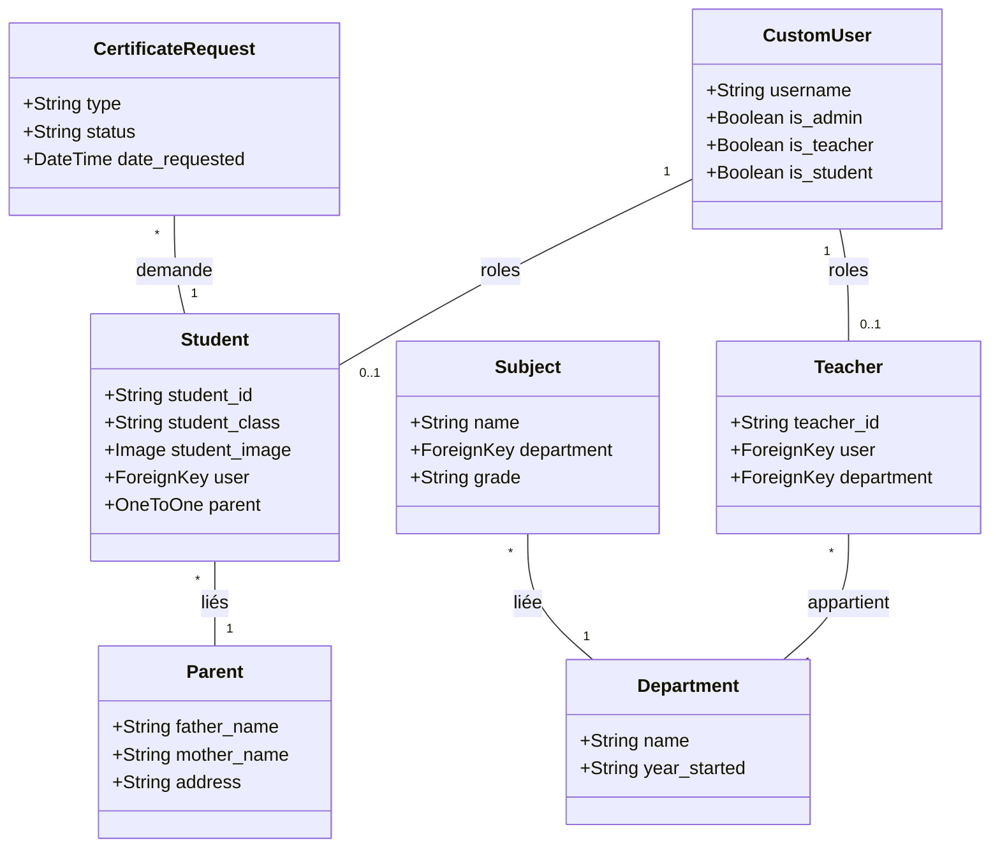
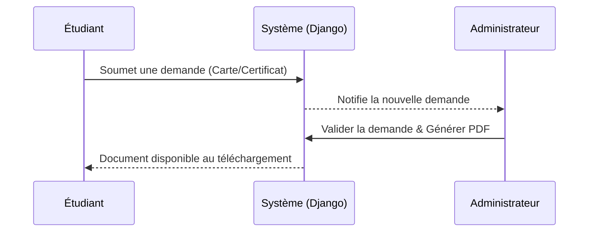
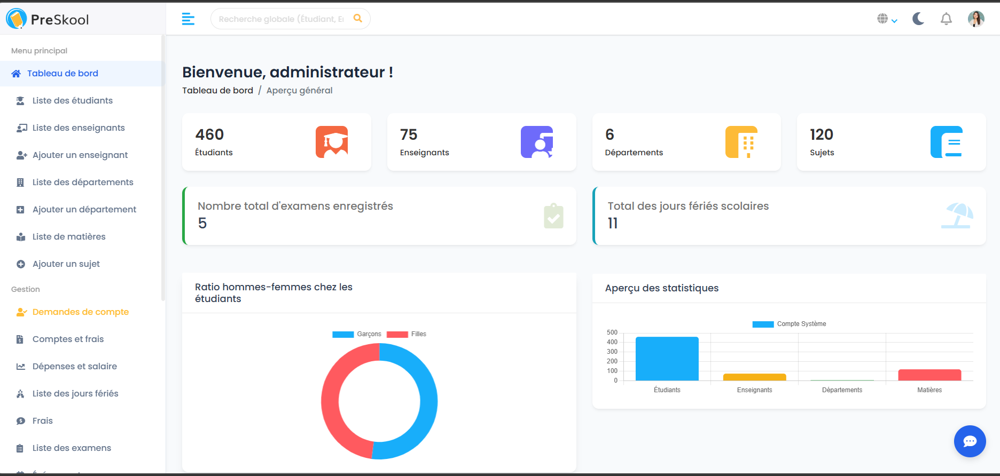
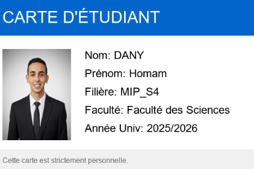
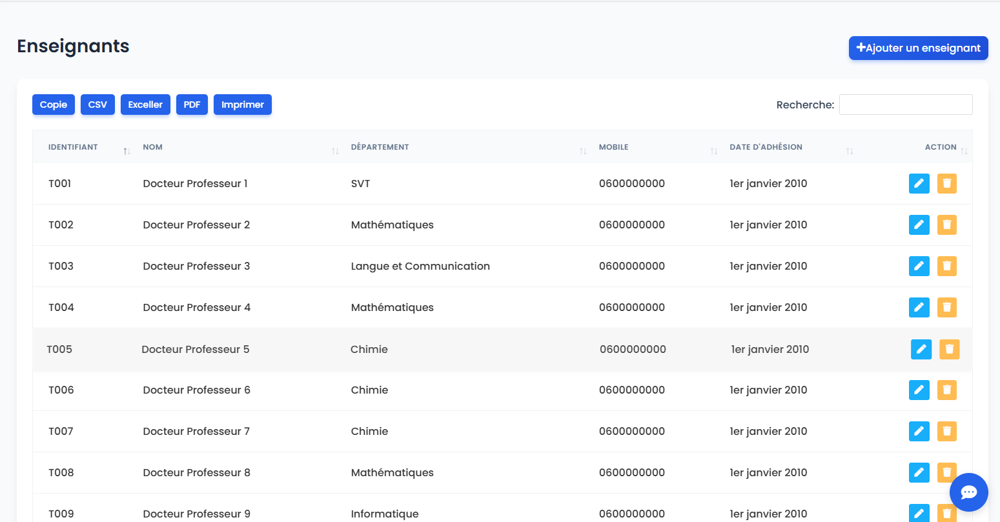
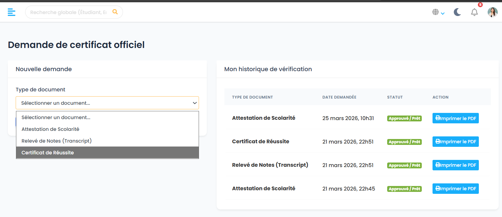

# 🎓 PreSkool Academy - Système de Gestion Scolaire


**PreSkool Academy** est une application web robuste de gestion d'établissement scolaire développée avec **Django**. Elle offre une plateforme centralisée pour les administrateurs, les enseignants, les étudiants et les parents, automatisant les processus académiques et administratifs.

---

## 🌟 Fonctionnalités Clés

### 🛠️ Espace Administration (Back-Office)
- **Gestion Complète (CRUD) :** Étudiants, Parents, Enseignants, Départements et Matières.
*   **Tableau de Bord Statistique :** Visualisation en temps réel des effectifs et des performances.
*   **Workflow d'Approbation :** Validation des demandes de cartes d'étudiant et de certificats officiels.

### 👨‍🏫 Espace Enseignant
- **Gestion de Classe :** Liste des étudiants affectés et suivi des cours.
- **Emploi du Temps :** Vue personnalisée des sessions et supervisions.
- **Profil Académique :** Détails sur le département et les matières enseignées.

### 🎓 Espace Étudiant & Parent
- **Profil Personnel :** Informations académiques et coordonnées.
- **Services Digitaux :** Demandes de cartes d'étudiant avec upload de photo et demandes de certificats (scolarité, réussite, relevés).
- **Consultation :** Suivi de la progression et de l'emploi du temps.

---

## 📊 Architecture Technique (UML)

### Diagramme de Classes
Voici la structure simplifiée des données du projet :



### Workflow de demande de document


---

## 📸 Galerie & Démonstration

| Tableau de Bord Admin | Carte Étudiant Digitale |
|:---:|:---:|
|  |  |

| Gestion des Enseignants | Demande de Certificats |
|:---:|:---:|
|  |  |

---

## 🚀 Installation & Lancement

Suivez ces étapes pour installer le projet localement :

### 1. Cloner le dépôt
```bash
git clone https://github.com/votre-username/Application_Web_Systeme_De_Gestion_Scolaire.git
cd Application_Web_Systeme_De_Gestion_Scolaire/school
```

### 2. Configurer l'environnement virtuel
```bash
python -m venv monenv
# Windows
.\monenv\Scripts\activate
# Linux/Mac
source monenv/bin/activate
```

### 3. Installer les dépendances
```bash
pip install -r requirements.txt
```

### 4. Lancer les migrations & le serveur
```bash
python manage.py makemigrations
python manage.py migrate
python manage.py runserver
```
Accédez au portail sur : `http://127.0.0.1:8000/`

---

## 🛠️ Stack Technique
- **Backend :** Django 4.x (Python)
- **Frontend :** HTML5, CSS3 (Vanilla + Bootstrap), JavaScript
- **Base de données :** SQLite (Développement)
- **Librairies :** Pillow (Images), ReportLab/XHTML2PDF (Génération PDF)

---

## 📝 Licence
Ce projet est sous licence MIT - voir le fichier [LICENSE](LICENSE) pour plus de détails.

---
*Réalisé dans le cadre du Projet Fin de Module (PFM).*
