# Rapport : Projet de gestion d'école (PreSkool)

## Sommaire
1. [Introduction](#1-introduction)
2. [Partie 1 : Mise en place de l'environnement et du projet](#2-partie-1--mise-en-place-de-lenvironnement-et-du-projet)
3. [Partie 2 : Configuration du projet](#3-partie-2--configuration-du-projet)
4. [Partie 3 : Templates et Fichiers Statiques](#4-partie-3--templates-et-fichiers-statiques)
5. [Partie 4 : Création de l'application Student, Modèles et Migrations](#5-partie-4--création-de-lapplication-student-modèles-et-migrations)
6. [Partie 5 : Interface d'Administration Django](#6-partie-5--interface-dadministration-django)

---

## 1. Introduction
Ce rapport documente la construction pas à pas d'une application web de gestion d'école (PreSkool) avec le framework Django. Il trace l'ensemble des commandes exécutées ainsi que leurs objectifs afin de construire le projet final. Ce document sera mis à jour au fur et à mesure de l'avancement des parties.

## 2. Partie 1 : Mise en place de l'environnement et du projet

**1.1 Création de l'environnement virtuel et activation**
* L'environnement virtuel `monenv` a été créé et activé, isolant les dépendances du projet `school`.

**1.2 Installation de Django**
* **Commande :** `pip install django`
* **Objectif :** Installation du framework web Python Django.
* **Mise à jour supplémentaire :** `python.exe -m pip install --upgrade pip` pour la mise à jour de l'outil de gestion des paquets `pip`.

**1.3 Création du projet Django**
* **Commandes :** 
  ```bash
  django-admin startproject school
  cd school
  ```
* **Objectif :** Création de l'architecture de base du projet global nommé `school` et navigation dans son dossier principal.

**1.4 Création de la première application : faculty**
* **Commande :** `py manage.py startapp faculty`
* **Objectif :** Génération de la première application indépendante `faculty` au sein du projet `school`, contenant les fichiers nécessaires pour gérer ses vues, modèles, et son administration.

## 3. Partie 2 : Configuration du projet

**2.1 Enregistrement de l'application dans settings.py**
* **Action :** Ajout de `'faculty',` dans la liste `INSTALLED_APPS` du fichier `school/settings.py`.
* **Objectif :** Informer le projet Django de l'existence de la nouvelle application pour qu'il puisse prendre en compte ses modèles, vues, et templates.

**2.2 Création du fichier urls.py de l'application faculty**
* **Action :** Création du fichier `faculty/urls.py` avec la route de base `path('', views.index, name='index')`.
* **Objectif :** Définir les routes URL spécifiques à l'application `faculty`.

**2.3 Liaison avec les URLs du projet principal**
* **Action :** Ajout de `path('', include('faculty.urls'))` dans le fichier `school/urls.py`.
* **Objectif :** Déléguer la gestion des URL de la racine du site vers le fichier de routage de l'application `faculty`.

**2.4 Création de la vue index dans faculty**
* **Action :** Création de la fonction `index(request)` dans `faculty/views.py` qui retourne l'affichage de "First Test".
* **Objectif :** Traiter la requête HTTP entrante sur la route principale et renvoyer une réponse texte simple pour tester le bon fonctionnement de la configuration.

**2.5 Démarrage et vérification du serveur**
* **Commande :** `py manage.py runserver`
* **Objectif :** Lancement du serveur de développement local Django. L'application est alors accessible sur l'adresse locale `http://localhost:8000/`. L'affichage du message "First Test" confirme que les liens entre la vue, les URLs de l'application et les URLs natives du projet fonctionnent correctement.

*Aperçu du résultat dans le navigateur :*
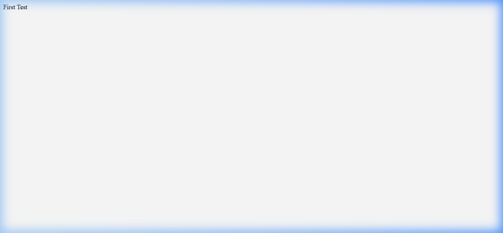

## 4. Partie 3 : Templates et Fichiers Statiques

**3.1 Création des dossiers static et templates**
* **Action :** Création des répertoires `static/` et `templates/` à la racine du projet `school`.
* **Objectif :** Organiser les fichiers statiques (CSS, JS, images) et les modèles HTML séparément du code Python.

**3.2 Configuration de settings.py pour les templates et les statiques**
* **Action :** Import de `os`, mise à jour du chemin `DIRS` dans la configuration `TEMPLATES`, et ajout des variables `STATIC_URL` et `STATICFILES_DIRS`.
* **Objectif :** Indiquer à Django où chercher les fichiers statiques et les templates HTML lors du rendu des pages.

**3.3 Import des assets Bootstrap**
* **Action :** Copie du dossier `assets/` (styles, scripts, images) contenant le thème PreSkool dans le répertoire `static/`.
* **Objectif :** Intégrer les styles visuels et la dynamique du tableau de bord.

**3.4 Intégration des templates HTML**
* **Action :** Création des fichiers `base.html` et `index.html` sous le répertoire `templates/Home/`. L'utilisation des balises `` permet de charger les ressources graphiques et `` d'hériter de la structure principale.
* **Objectif :** Structurer les pages du site avec le moteur de template dynamique de Django.

**3.5 Mise à jour de la vue pour utiliser un template**
* **Action :** Modification de `faculty/views.py` pour utiliser la fonction `render` et retourner le template `Home/index.html`.
* **Objectif :** Lier la logique de la vue à la nouvelle interface graphique HTML plutôt qu'à un simple texte. La vue est désormais testée et fonctionnelle.

*Aperçu du tableau de bord (Dashboard) intégré :*
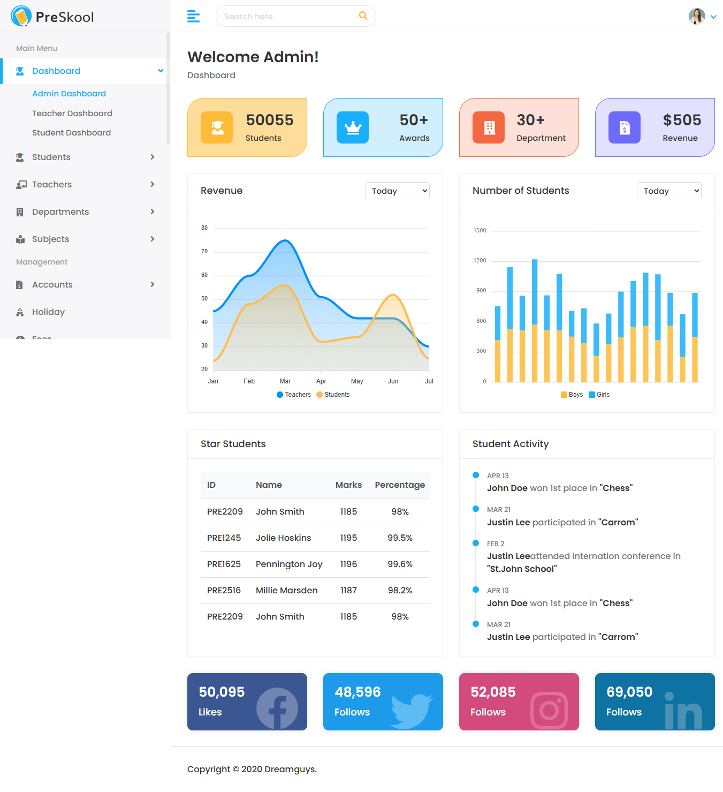

## 5. Partie 4 : Création de l'application Student, Modèles et Migrations

**4.1 Création de l'application student**
* **Commande :** `py manage.py startapp student`
* **Objectif :** Créer un module distinct pour la gestion des étudiants et de leurs parents.

**4.2 Enregistrement de l'application student dans settings.py**
* **Action :** Ajout de `'student'` dans la liste `INSTALLED_APPS` du fichier `school/settings.py`.
* **Objectif :** Permettre à Django de détecter et d'intégrer l'application `student` dans le projet principal.

**4.3 Création de urls.py pour l'application student**
* **Action :** Définition des routes locales de l'application (`student_list` et `add_student`) et liaison de ces routes dans `school/urls.py` via `path('student/', include('student.urls'))`.
* **Objectif :** Structurer le routage des URL relatives aux étudiants. *(Note : des vues temporaires ont été créées conjointement dans `student/views.py` pour valider les routes et permettre la migration sans erreur).*

**4.4 Définition des modèles dans student/models.py**
* **Action :** Création des classes Python `Parent` et `Student` (héritant de `models.Model`), avec une relation `OneToOneField` entre l'étudiant et son parent.
* **Objectif :** Modéliser la structure de la base de données de l'application (champs de textes, dates, images, relations). *(Note : Une légère erreur de syntaxe `models.model` au lieu de `models.Model` a été corrigée).*

**4.5 Installation de Pillow pour ImageField**
* **Commande :** `python -m pip install Pillow`
* **Objectif :** Installer la bibliothèque requise pour gérer le champ d'upload d'image `student_image`.

**4.6 Création des fichiers de migration**
* **Commande :** `py manage.py makemigrations`
* **Objectif :** Générer les scripts Python reflétant la création des tables `Parent` et `Student`. 

**4.7 Application des migrations**
* **Commande :** `py manage.py migrate`
* **Objectif :** Exécuter les scripts de migration afin de créer concrètement toutes les tables requises (y compris celles par défaut de Django) dans la base de données SQLite.

*Aperçu de l'exécution des migrations :*
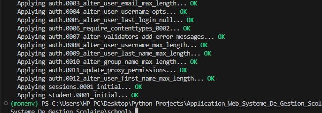

## 6. Partie 5 : Interface d'Administration Django

**5.1 Création d'un super-utilisateur (Superuser)**
* **Commande :** `py manage.py createsuperuser`
* **Identifiants créés :** Utilisateur `Houssam`, email `elhajiouihoussam@gmail.com`.
* **Objectif :** Créer un compte administrateur avec tous les privilèges pour accéder au panneau d'administration sécurisé de Django et gérer le contenu de la base de données.

**5.2 Enregistrement des modèles dans l'interface admin**
* **Action :** Mise à jour du fichier `student/admin.py` pour enregistrer les modèles `Parent` et `Student` en utilisant le décorateur `@admin.register()` avec des classes `ModelAdmin` personnalisées :
  * **ParentAdmin :** affichage des colonnes `father_name`, `mother_name`, `father_mobile`, `mother_mobile` ; recherche et filtrage par nom des parents.
  * **StudentAdmin :** affichage de toutes les informations clés (nom, prénom, ID, genre, date de naissance, classe, etc.) ; recherche par nom/ID/classe ; filtrage par genre, classe et section.
* **Objectif :** Rendre ces modèles visibles et gérables (opérations CRUD) directement depuis l'interface web d'administration de Django, avec une présentation optimisée.

**5.3 Vérification de l'interface d'administration**
* **Action :** Accès à `http://localhost:8000/admin/` avec les identifiants du super-utilisateur, ajout de données de test (un parent et un étudiant), et vérification de l'affichage.
* **Objectif :** Valider que les modèles sont correctement enregistrés et que les listes d'affichage, les filtres et la recherche fonctionnent comme prévu.

*Aperçu du panneau d'administration :*
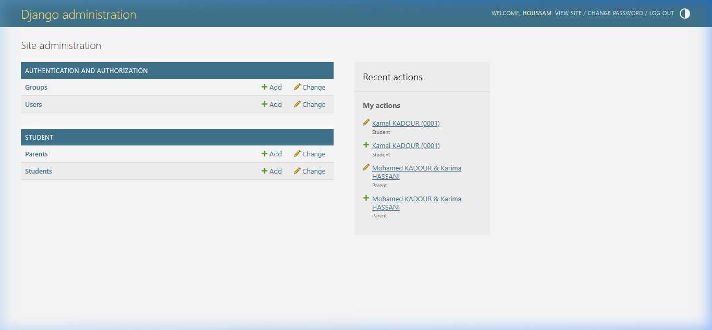

*Liste des parents enregistrés :*
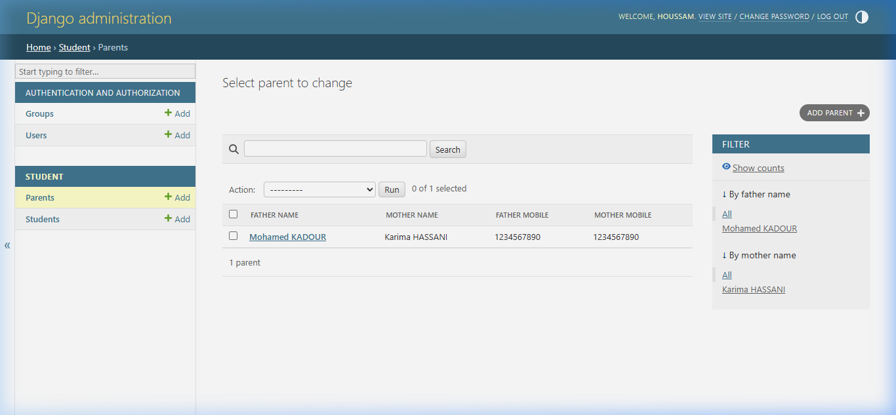

*Liste des étudiants enregistrés :*
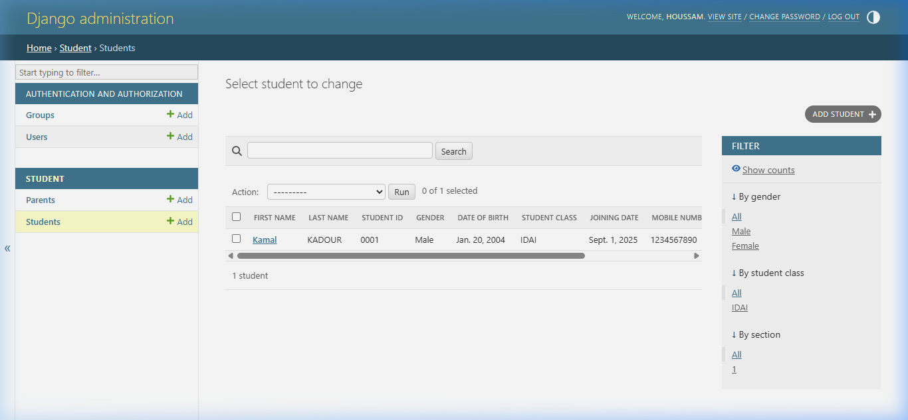

## 7. Partie 6 : Vues CRUD pour la Gestion des Étudiants

**6.1 Mise à jour de student/views.py**
* **Action :** Création des fonctions de vues (CRUD) pour chaque opération : `student_list`, `add_student`, `edit_student`, `view_student`, `delete_student`.
* **Objectif :** Gérer les requêtes HTTP pour l'affichage, l'ajout, la consultation, la modification et la suppression d'étudiants.

**6.2 Mise à jour des routes dans student/urls.py**
* **Action :** Ajout des routes correspondant à chaque vue CRUD, en utilisant des paramètres tels que `<str:student_id>` pour identifier précisément quel étudiant ou parent est ciblé.
* **Objectif :** Associer les URLs appropriées (listes de données ou actions spécifiques) aux vues.

**6.3 Implémentation de la vue d'ajout d'un étudiant**
* **Action :** Développement de la logique POST dans `add_student` pour récupérer les données du formulaire HTML, créer d'abord un enregistrement `Parent`, puis l'instance `Student` liée au parent, et rediriger l'utilisateur vers la liste des étudiants avec un message de succès (via le module messages de Django).
* **Objectif :** Permettre l'enregistrement conjoint d'un parent et d'un étudiant de manière fluide et sécurisée dans la base de données.

**6.4 Liaison des menus aux routes**
* **Action :** Modification du fichier de template partagé `templates/Home/base.html` pour utiliser les balises locales `` comme `` et `` dans les attributs HTML `href` du menu de navigation.
* **Objectif :** Lier dynamiquement les liens du menu latéral du tableau de bord aux vues et URLs du projet, s'assurant ainsi que toute mise à jour de route côté backend est répercutée automatiquement côté front.

*Aperçu de la page listant les étudiants (Student List) :*
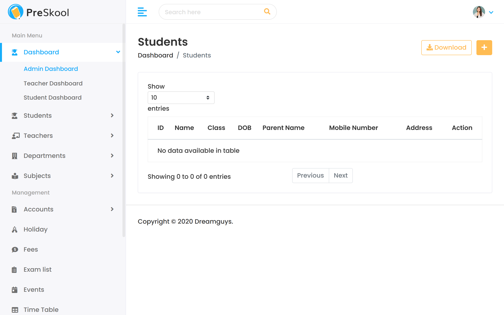

*Aperçu du formulaire d'ajout d'étudiant (Add Student) :*
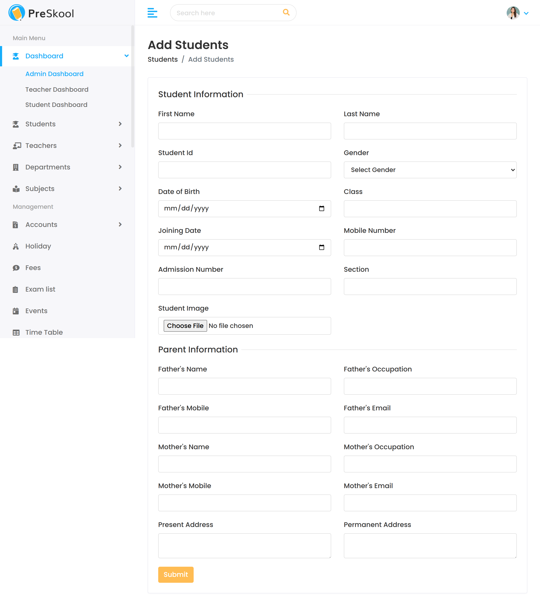

## 8. Partie 7 : Conception et Modélisation (UML)

La réussite d'un projet complexe comme PreSkool repose sur une phase de conception rigoureuse. Nous avons utilisé le langage UML pour modéliser les différents aspects du système.

### 7.1 Diagramme de Cas d'Utilisation (Use Case Diagram)
Ce diagramme illustre les interactions entre les trois acteurs principaux (Admin, Enseignant, Étudiant) et les fonctionnalités du système. Il met en évidence la séparation des responsabilités et les services offerts à chaque profil.
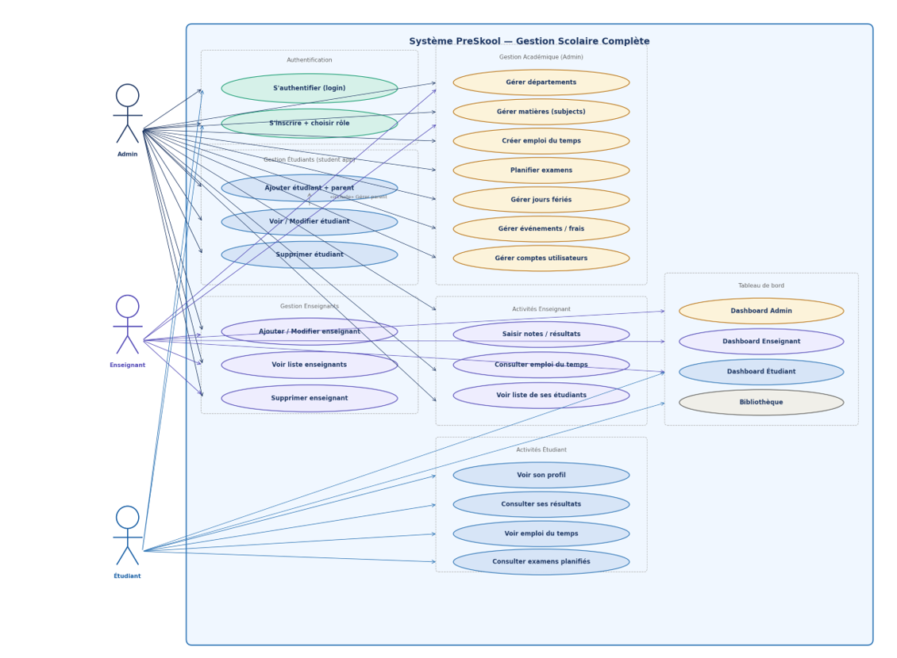

### 7.2 Diagramme de Classes
Le diagramme de classes représente la structure statique du système. Il détaille les modèles Django (entités), leurs attributs et surtout les relations (One-to-One, Foreign Key) qui lient les étudiants aux parents, et les enseignants aux départements.
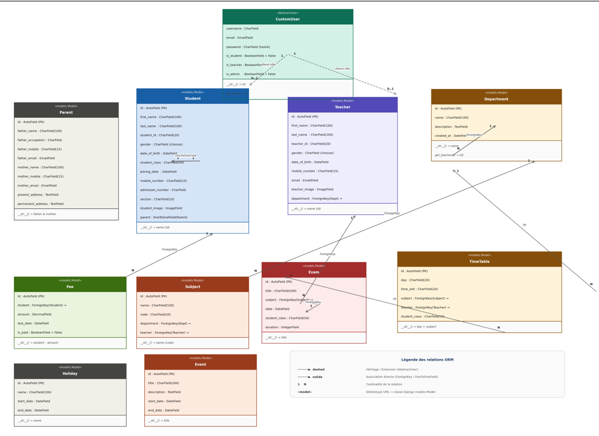

### 7.3 Diagramme de Séquence
Ce diagramme détaille le flux dynamique des messages lors d'une opération critique, comme l'authentification ou la création d'un étudiant. Il montre comment les requêtes circulent entre le navigateur, le routeur d'URL, la vue Django et la base de données.
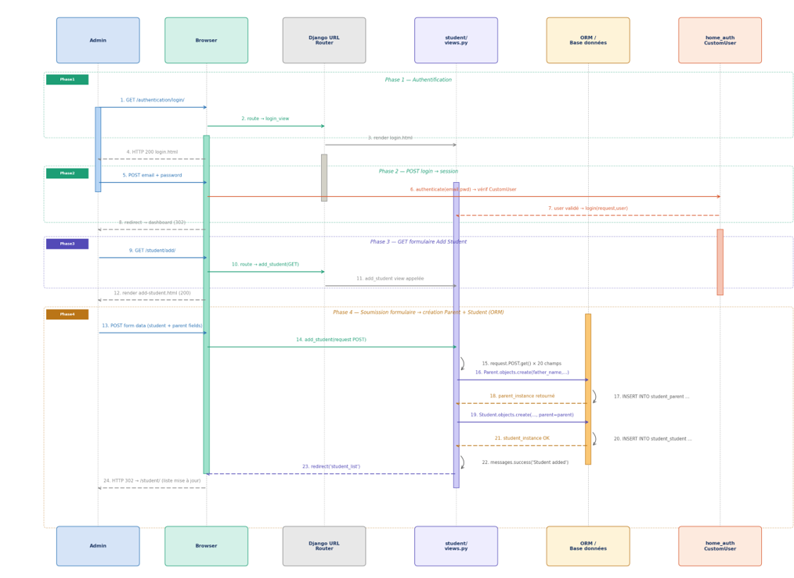

### 7.4 Diagramme d'Activité
Le diagramme d'activité modélise le flux de contrôle. Il représente ici le processus de connexion, incluant les vérifications de sécurité et la redirection conditionnelle vers le tableau de bord approprié selon le rôle de l'utilisateur.
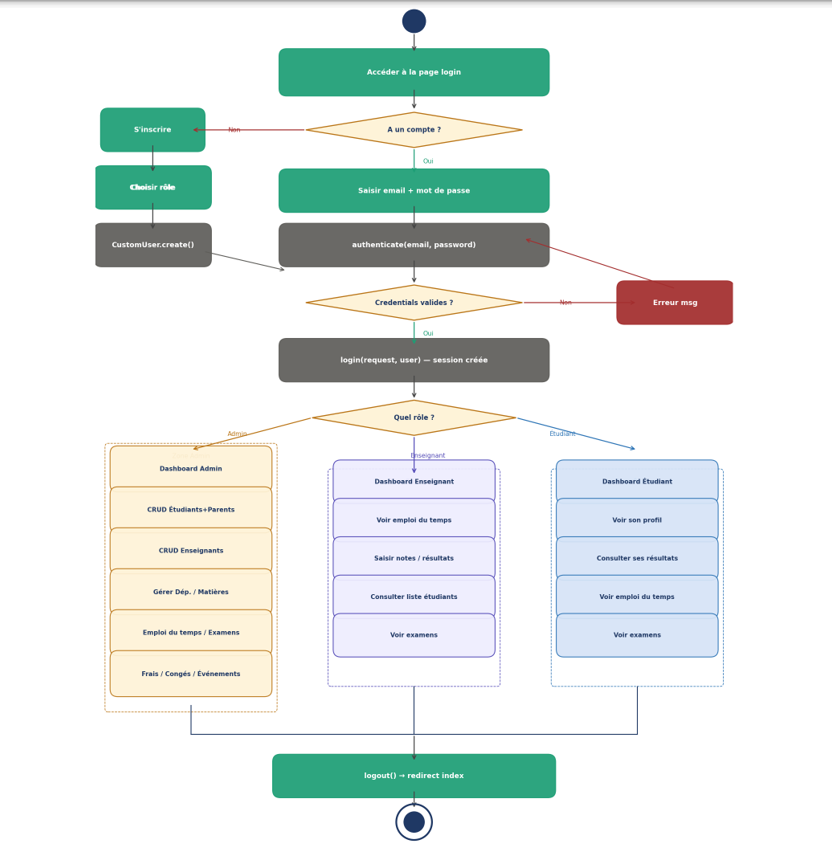

## 9. Partie 8 : Module d'Authentification personnalisé


Dans cette section, un système complet d'authentification a été conçu avec un modèle d'utilisateur personnalisé capable de gérer trois rôles distincts (Administrateur, Enseignant, Étudiant) et équipé de fonctionnalités avancées telles que la réinitialisation de mot de passe par mail.

**7.1 Création et configuration de l'application home_auth**
* **Action :** Création de la nouvelle application via `py manage.py startapp home_auth` et ajout de `'home_auth'` dans `INSTALLED_APPS` (fichier `settings.py`).
* **Objectif :** Obtenir un module indépendant exclusif à la gestion rigoureuse de l'authentification et des différents utilisateurs.

**7.2 Définition du modèle CustomUser et PasswordResetRequest**
* **Action :** Création du modèle `CustomUser` (héritant d'`AbstractUser`) dans `home_auth/models.py`. Des champs booléens y ont été associés (`is_admin`, `is_teacher`, `is_student`) pour définir le statut. Un deuxième modèle `PasswordResetRequest` a été ajouté pour gérer la logique de création et vérification de requêtes de réinitialisation de mot de passe via l'envoi de tokens uniques.
* **Objectif :** Subdiviser et personnaliser les comportements des classes d'utilisateurs natifs de Django pour mieux répondre aux profils spécifiques d'un établissement scolaire.

**7.3 Refonte et liaison des Urls**
* **Action :** Configuration du nouveau fichier de routage `home_auth/urls.py` avec les endpoints `login/`, `signup/`, `logout/` et connexion au fichier principal `school/urls.py` sous le préfixe `authentication/`.
* **Objectif :** Établir l'arborescence adéquate pour séparer l'accès aux pages publiques du back-office.

**7.4 Configuration du modèle utilisateur dans settings.py**
* **Action :** Configuration de la variable clé `AUTH_USER_MODEL = 'home_auth.CustomUser'` ainsi que des liens par défaut (`LOGIN_URL`, `LOGIN_REDIRECT_URL`). Cette étape délicate a nécessité la suppression complète du précédent `db.sqlite3` ainsi que de son historique de migrations, suivi par la reconstruction structurelle globale de la base (via un nouveau `makemigrations` et `migrate`) pour éviter un conflit inéluctable avec la table standard.
* **Objectif :** Forcer Django et son ORM à basculer du mécanisme d'authentification par défaut vers la version customisée intégrant nos rôles.

**7.5 Logique des Vues : Inscription, Connexion et Redistribution**
* **Action :** Implémentation du backend traitant les requêtes POST d'authentification dans `home_auth/views.py`.
  * **La vue d'inscription (`signup_view`) :** Extrait les données, instancie l'enregistrement de l'utilisateur sécurisé (avec hachage de mot de passe) puis octroie les autorisations nécessaires sur la base du champ `role`.
  * **La vue de connexion (`login_view`) :** Authentifie l'utilisateur via la fonction native `authenticate()`. Une fois `login()` invoqué, l’utilisateur est instantanément et conditionnellement redirigé vers *son* tableau de bord défini selon ses permissions (`is_admin`, `is_teacher`, `is_student`).
* **Objectif :** Protéger le portail tout en redirigeant intelligemment le flux de nouveaux arrivants sur la plateforme vers l'espace qui les concerne.

**7.6 Exploitation au sein de l'Admin Interface**
* **Action :** Implémentation d'une structure sur-mesure de `UserAdmin` nommée `CustomUserAdmin` (dans `home_auth/admin.py`), modifiant les regroupements de champs natifs (fieldsets) pour afficher notamment le statut de rôle. Une fonction de sécurité logicielle a été incrustée dans `get_queryset` afin d'isoler les requêtes entre membres de l'équipe et éviter qu'un compte standard n'édite un compte super-administrateur.
* **Objectif :** Offrir à l'administrateur principal un panneau visuel complet et fluide pour intervenir sur ou créer les utilisateurs.

*Aperçu de la page de connexion (Login) :*
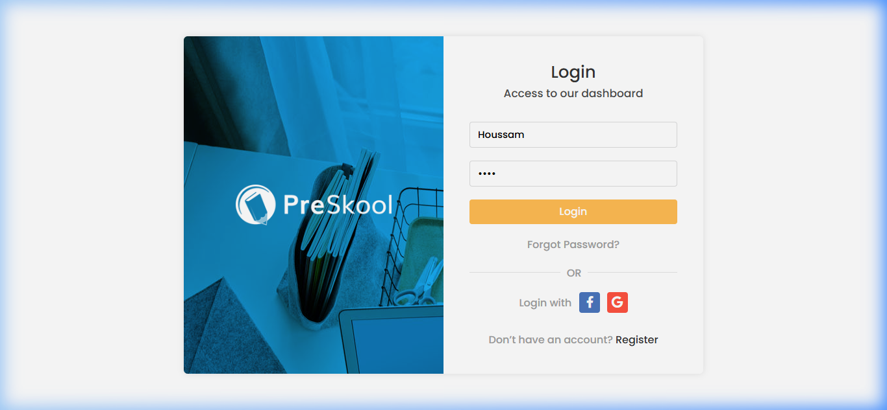

## 10. Partie 9 : Système de Gestion des Enseignants (CRUD)

Le module Enseignants est essentiel pour structurer l'équipe pédagogique. Il permet non seulement de stocker les informations personnelles, mais aussi de lier chaque professeur à sa spécialité académique.

*   **Logic métier :** Chaque enseignant est rattaché à un `CustomUser` pour son accès au portail, et à un `Department` pour définir son appartenance facultaire.
*   **Fonctionnement :** L'interface administrateur utilise des `ModelForms` pour garantir l'intégrité des données lors de l'ajout. La liste affiche les informations clés (Identifiant, Département, Mobile) pour une identification rapide.

*Aperçu de la liste des enseignants (Gestion centralisée du corps professoral) :*


## 11. Partie 10 : Gestion des Départements et des Matières

Afin d'organiser les enseignements, nous avons mis en place une structure hiérarchique stricte.

### 9.1 Les Départements
Le département représente l'unité structurelle (ex: Mathématiques, Informatique). Il permet de filtrer les enseignants et de regrouper les matières par spécialité.
*Aperçu des départements configurés :*
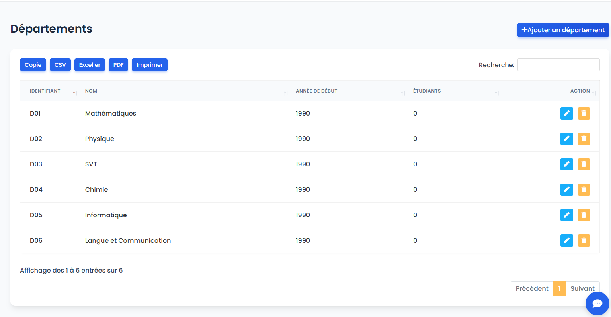

### 9.2 Les Matières (Subjects)
Les matières sont le cœur de l'enseignement. Chaque matière est liée dynamiquement à un département et à un niveau (classe). Cette modélisation permet d'automatiser l'affichage des cours disponibles pour chaque étudiant en fonction de son inscription.
*Aperçu du catalogue des matières :*
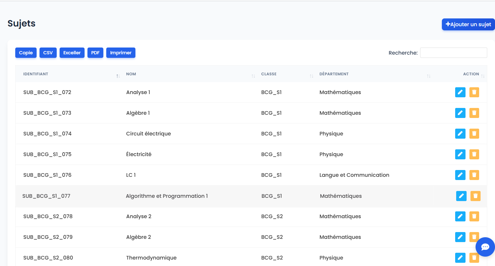

## 12. Partie 11 : Tableaux de Bord Spécifiques (Dashboards)

### 10.1 Dashboard Administrateur
L'administrateur dispose d'une vue "360 degrés". Des graphiques (via Chart.js) affichent la répartition hommes/femmes des étudiants et le volume des effectifs par département. C'est ici que les décisions stratégiques sont prises.


### 10.2 Dashboard Enseignant
Le tableau de bord enseignant est focalisé sur l'animation pédagogique. Il affiche en priorité son emploi du temps quotidien et le nombre d'étudiants sous sa supervision pour la journée.
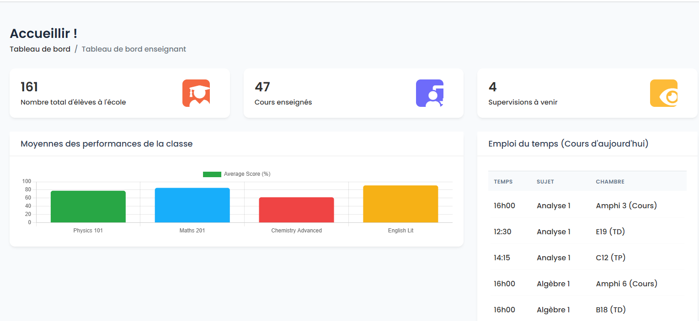

### 10.3 Dashboard Étudiant
L'étudiant accède à un espace personnel "Self-Service". Il peut y voir sa progression, son assiduité et ses prochains examens. C'est également le point de départ pour toutes ses démarches administratives.
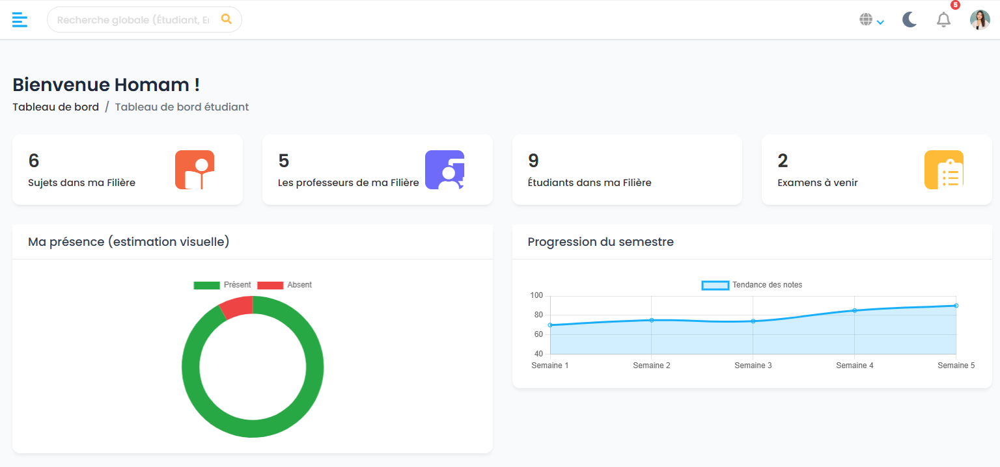

## 13. Partie 12 : Fonctionnalités Avancées (Cartes et Certificats)

Cette partie automatise le bureau de la scolarité, réduisant les délais et le papier.

### 11.1 Génération de Cartes d'Étudiant
*   **La demande :** L'étudiant soumet une photo d'identité numérique et choisit son groupe sanguin.
*   **La validation :** L'administrateur vérifie la qualité de la photo dans un panneau dédié.
*   **La génération :** Une fois validée, le système génère un document PDF aux dimensions standards d'une carte d'identité, incluant le QR Code (optionnel) et la photo.
*Aperçu d'une carte générée au format officiel :*


### 11.2 Demandes de Certificats Officiels (Self-Service)
*   **Workflow :** L'étudiant sélectionne le type de document souhaité (Attestation de scolarité, Relevé de notes).
*   **Suivi :** Un historique permet de voir l'état de la demande (En attente / Approuvé / Prêt).


### 11.3 Approbation et Génération (Côté Admin)
L'administration traite les demandes par lot. Pour chaque certificat approuvé, le serveur génère un PDF formaté avec les entêtes de l'établissement et un tampon numérique de validité.
*Aperçu du panneau d'approbation administrateur :*
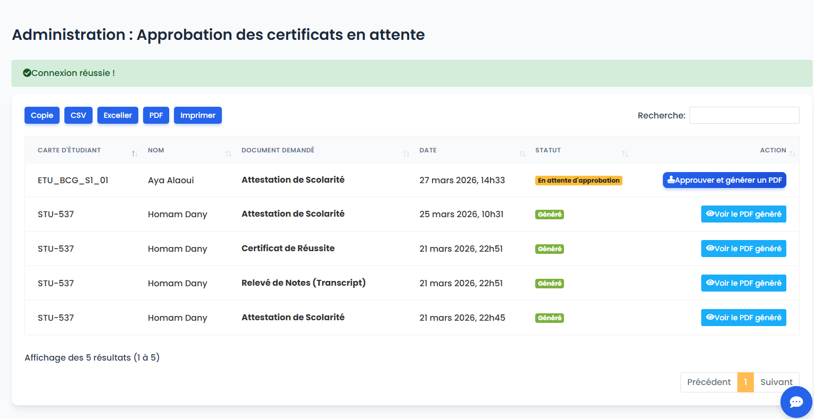

*Résultat final : Exemple d'un certificat officiel prêt à être imprimé ou envoyé :*
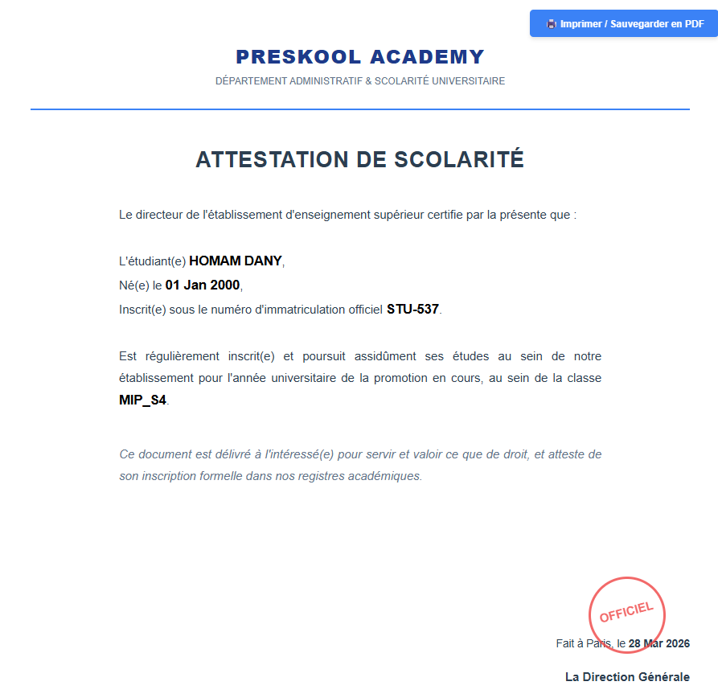

## 14. Conclusion
Le projet PreSkool ne se limite pas à une simple base de données d'étudiants. C'est un véritable écosystème numérique qui simplifie la vie scolaire. L'utilisation de Django a permis d'intégrer des fonctionnalités complexes comme la génération de PDF à la volée et une gestion fine des droits d'accès, garantissant ainsi sécurité et efficacité.

